# Aplikasi Web "Kanboard"

| [Sekilas Tentang](#sekilas-tentang) | [Instalasi](#instalasi) | [Konfigurasi](#konfigurasi) | [Maintenance](#maintenance) | [Otomatisasi](#otomatisasi) | [Cara Pemakaian](#cara-pemakaian) | [Pembahasan](#pembahasan) | [Referensi](#referensi) |
| --- | --- | --- | --- | --- | --- | --- | --- |

**Anggota Kelompok:**

| Nama | NIM |
| --- | --- |
| Ayubi Fathan | M0403241050 |
| Syahwali Khan Habibi Harahap | M0403241128 |
| Micko Fahraezi | M0403241033 |
| Nafil Khautal Budiono | M0403241102 |
| Muhammad Syaamil | M0403241115 |

---

## Sekilas Tentang

[`^ kembali ke atas ^`](#aplikasi-web-kanboard)

**Kanboard** adalah aplikasi web manajemen proyek *open source* yang berfokus pada metode **Kanban**. Pekerjaan divisualisasikan sebagai kartu (*task*) yang dipindahkan antar kolom, misalnya *Backlog*, *Ready*, *Work in progress*, dan *Done*, sehingga seluruh anggota tim dapat melihat status pekerjaan secara sekilas.

Kanboard dikembangkan oleh **Frédéric Guillot** bersama komunitas kontributor dan didistribusikan di bawah **lisensi MIT**. Aplikasi ini ditulis dalam bahasa **PHP** dan dapat memakai basis data **SQLite, MySQL/MariaDB, atau PostgreSQL**. Repositori resminya di GitHub telah memperoleh sekitar 9,8 ribu *star*.

Saat ini Kanboard berstatus ***maintenance mode***: pengembang utamanya tidak lagi menambahkan fitur besar, tetapi rilis baru tetap diterbitkan secara berkala dari kontribusi komunitas, dan *pull request* untuk perbaikan maupun fitur baru masih diterima.

Fitur utama Kanboard antara lain:

- Papan Kanban dengan *drag-and-drop* antar kolom
- Batas jumlah *task* per kolom (*WIP limit*)
- *Swimlane* untuk mengelompokkan *task* secara horizontal
- *Subtask*, komentar, lampiran, dan deskripsi berformat Markdown
- *Automatic actions* (aksi otomatis berdasarkan kejadian)
- Pencatatan waktu (*time tracking*) dan analitik proyek
- Manajemen pengguna, grup, dan hak akses per proyek
- API JSON-RPC, *webhook*, langganan iCalendar dan RSS
- Dukungan *plugin* untuk menambah fungsi

---

## Instalasi

[`^ kembali ke atas ^`](#aplikasi-web-kanboard)

### Lingkungan yang Digunakan

| Komponen | Spesifikasi |
| --- | --- |
| Penyedia | VPS Murah (Data Center Cyber 1, Jakarta) |
| Sistem operasi | Ubuntu 24.04 LTS |
| CPU / RAM / Disk | 2 vCPU / 2 GB RAM / 20 GB SSD |
| Jaringan | IP publik bersama (*shared IP*) dengan *port forwarding* |
| Biaya | Rp30.500 per bulan |
| Metode instalasi | Docker Engine + Docker Compose |

> **Catatan:** Pada laporan ini alamat asli disamarkan. Ganti `<IP-PUBLIK>`, `<PORT-SSH>`, dan `<PORT-WEB>` sesuai informasi di panel VPS masing-masing.

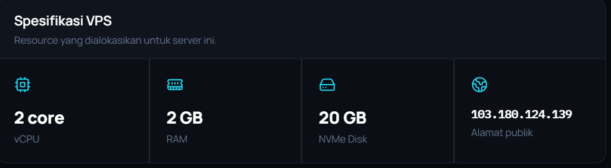

### Prasyarat

- VPS dengan Ubuntu 22.04/24.04 LTS dan akses SSH
- Akun dengan hak `sudo`
- Koneksi internet di sisi server untuk mengunduh paket dan *image* Docker
- *Port* web yang dapat diakses dari luar (melalui *port forwarding* di panel penyedia)

Kebutuhan sistem Kanboard sendiri (PHP 8.1 ke atas, web server, dan ekstensi PHP) sudah tersedia di dalam *image* Docker resmi, sehingga tidak perlu dipasang manual.

### Langkah Instalasi

1. **Masuk ke server melalui SSH.** Karena IP publik dipakai bersama, penyedia memberikan *port* SSH khusus untuk setiap VPS.

    ```bash
    ssh -p <PORT-SSH> ayubi@<IP-PUBLIK>
    ```

    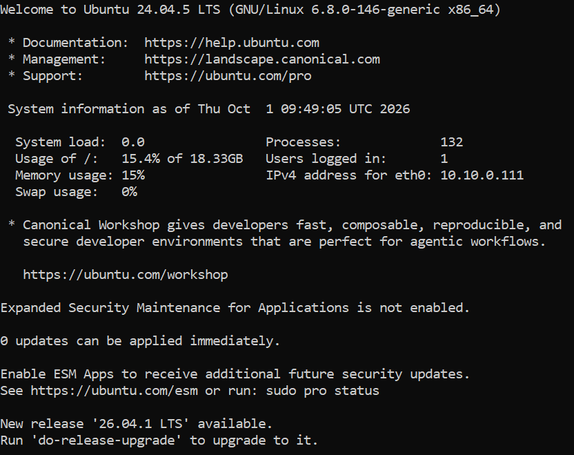

2. **Perbarui paket sistem.**

    ```bash
    sudo apt update && sudo apt upgrade -y
    ```

3. **Tambahkan repositori resmi Docker.**

    ```bash
    sudo apt install -y ca-certificates curl
    sudo install -m 0755 -d /etc/apt/keyrings
    sudo curl -fsSL https://download.docker.com/linux/ubuntu/gpg -o /etc/apt/keyrings/docker.asc
    sudo chmod a+r /etc/apt/keyrings/docker.asc

    sudo tee /etc/apt/sources.list.d/docker.sources <<EOF
    Types: deb
    URIs: https://download.docker.com/linux/ubuntu
    Suites: $(. /etc/os-release && echo "${UBUNTU_CODENAME:-$VERSION_CODENAME}")
    Components: stable
    Architectures: $(dpkg --print-architecture)
    Signed-By: /etc/apt/keyrings/docker.asc
    EOF

    sudo apt update
    ```

4. **Pasang Docker Engine dan plugin Docker Compose.**

    ```bash
    sudo apt install -y docker-ce docker-ce-cli containerd.io docker-buildx-plugin docker-compose-plugin
    ```

5. **Uji instalasi Docker.** Jika muncul pesan *Hello from Docker!*, Docker sudah berjalan dengan benar.

    ```bash
    sudo docker run hello-world
    ```

    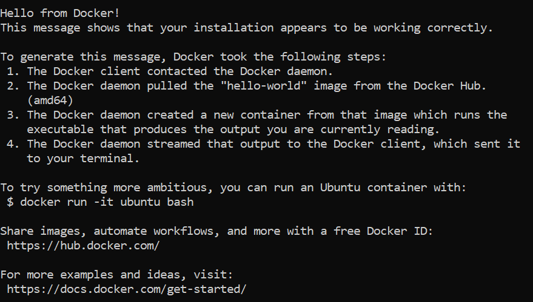

6. **Izinkan pengguna menjalankan Docker tanpa `sudo`**, lalu keluar dan login kembali agar grup baru aktif.

    ```bash
    sudo usermod -aG docker $USER
    exit
    ```

7. **Buat direktori dan berkas `docker-compose.yml`.** *Port* 80 di dalam *container* dipetakan ke *port* 8080 di server, karena *port* standar (25/80/443) pada IP bersama hanya tersedia untuk paket IP *dedicated*.

    ```bash
    mkdir -p ~/kanboard && cd ~/kanboard
    nano docker-compose.yml
    ```

    Isi berkas ([docker-compose.yml](docker-compose.yml)):

    ```yaml
    services:
      kanboard:
        image: kanboard/kanboard:latest
        container_name: kanboard
        restart: unless-stopped
        ports:
          - "8080:80"
        volumes:
          - kanboard_data:/var/www/app/data
          - kanboard_plugins:/var/www/app/plugins

    volumes:
      kanboard_data:
      kanboard_plugins:
    ```

    - `restart: unless-stopped` membuat Kanboard otomatis berjalan lagi setelah server *reboot*.
    - *Volume* `kanboard_data` menyimpan basis data SQLite dan lampiran, sehingga data tidak hilang saat *container* diperbarui.

8. **Jalankan Kanboard dan periksa statusnya.** Status yang benar adalah `Up (healthy)`.

    ```bash
    docker compose up -d
    docker compose ps
    curl -I http://localhost:8080
    ```

    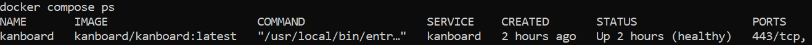

9. **Teruskan *port* web di panel VPS.** Buka menu *port forwarding* di panel penyedia, isi **Port di VPS** = `8080`, protokol **TCP**, label `kanboard`, lalu simpan. Panel akan menampilkan *port* publik yang dapat diakses dari internet.

    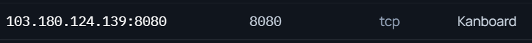

10. **Akses Kanboard melalui browser** di `http://<IP-PUBLIK>:<PORT-WEB>`. Login dengan akun bawaan `admin` / `admin`, lalu **segera ganti kata sandi** melalui menu profil karena aplikasi sudah dapat diakses publik.

    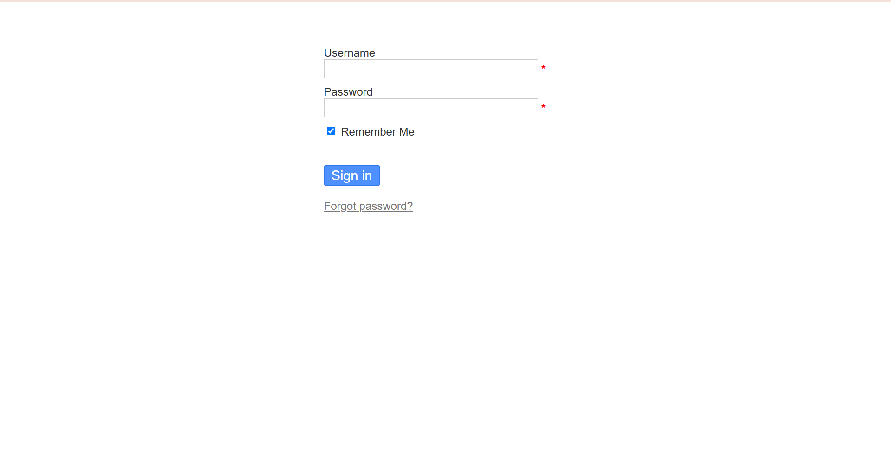

### Kendala yang Ditemui

Selama proses instalasi kami menemui beberapa kendala berikut beserta solusinya:

| Kendala | Penyebab | Solusi |
| --- | --- | --- |
| VM VirtualBox terhenti dengan pesan `watchdog: BUG: soft lockup` (tahap uji coba lokal) | VirtualBox berbenturan dengan Hyper-V/WSL2 yang dipakai Docker Desktop di Windows | Menonaktifkan *hypervisor* Windows dengan `bcdedit /set hypervisorlaunchtype off`, lalu *restart* laptop |
| VM tidak mendapat alamat IPv4 | DHCP IPv4 belum aktif di konfigurasi netplan | `sudo netplan set ethernets.enp0s3.dhcp4=true` lalu `sudo netplan apply` |
| SSH ke VPS *timeout* | Jaringan WiFi kampus memblokir koneksi SSH keluar | Menggunakan *hotspot* ponsel |
| SSH ditolak `Permission denied (publickey)` di *port* 22 | IP publik dipakai bersama sehingga *port* 22 bukan milik VPS kami | Menggunakan *port* SSH khusus dari panel (`ssh -p <PORT-SSH> ...`) |
| Browser menampilkan "Domain belum terhubung ke VPS" | Akses HTTP ke IP bersama diarahkan berdasarkan nama domain | Mengakses aplikasi melalui *port forwarding* |
| *Port* 80 tidak dapat diteruskan | *Port* standar hanya untuk paket IP *dedicated* | Memetakan Kanboard ke *port* 8080 |
| Pembuatan proyek gagal: *"This value must be alphanumeric"* | Kolom *Identifier* berisi spasi | Mengosongkan kolom atau mengisi huruf/angka tanpa spasi |

---

## Konfigurasi

[`^ kembali ke atas ^`](#aplikasi-web-kanboard)

### Pengaturan Aplikasi

Pengaturan umum dapat diubah melalui **Settings > Application settings**, misalnya bahasa antarmuka, zona waktu, format tanggal, dan URL aplikasi.

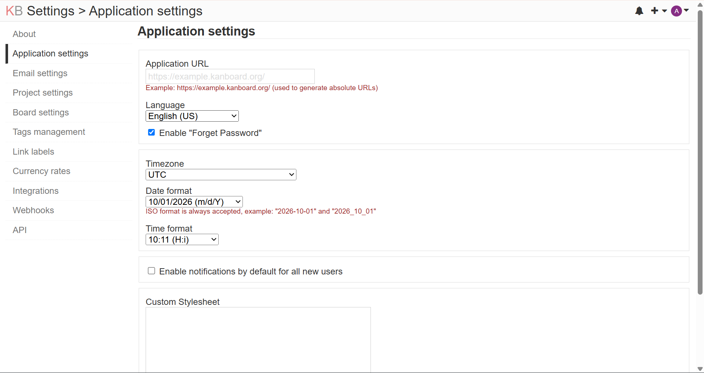

### Variabel Lingkungan dan Berkas Konfigurasi

Semua opsi konfigurasi Kanboard dapat diberikan sebagai *environment variable* pada `docker-compose.yml`. Alternatifnya, berkas `config.php` kustom dapat disimpan di dalam *volume* data (`/var/www/app/data/config.php`), lalu *container* dijalankan ulang.

### Mengaktifkan Instalasi Plugin dari Antarmuka Web

Demi keamanan, instalasi *plugin* melalui antarmuka web dinonaktifkan secara bawaan. Untuk mengaktifkannya, tambahkan variabel berikut pada *service* `kanboard` di `docker-compose.yml`, lalu jalankan `docker compose up -d`:

```yaml
    environment:
      - PLUGIN_INSTALLER=true
```

### Notifikasi Email

*Image* Docker resmi tidak mendukung metode `mail` dan `sendmail`, sehingga notifikasi email harus dikirim melalui SMTP atau *plugin* seperti Mailgun, Sendgrid, dan Postmark.

### Basis Data untuk Tim Besar (Opsional)

Instalasi kami memakai SQLite karena paling sederhana dan cukup untuk tim kecil. Dokumentasi resmi menyarankan MySQL/PostgreSQL untuk tim yang lebih besar, merekomendasikan PostgreSQL, dan menganjurkan agar SQLite tidak dipakai bersama Docker. Contoh konfigurasi dengan PostgreSQL:

```yaml
services:
  kanboard:
    image: kanboard/kanboard:latest
    restart: unless-stopped
    ports:
      - "8080:80"
    volumes:
      - kanboard_data:/var/www/app/data
      - kanboard_plugins:/var/www/app/plugins
    environment:
      DATABASE_URL: postgres://kanboard:GANTI-PASSWORD@db/kanboard
    depends_on:
      db:
        condition: service_healthy
  db:
    image: postgres:16
    restart: unless-stopped
    environment:
      POSTGRES_USER: kanboard
      POSTGRES_PASSWORD: GANTI-PASSWORD
      POSTGRES_DB: kanboard
    volumes:
      - db:/var/lib/postgresql/data
    healthcheck:
      test: ["CMD", "pg_isready", "-U", "kanboard"]
      interval: 10s
      timeout: 5s

volumes:
  kanboard_data:
  kanboard_plugins:
  db:
```

---

## Maintenance

[`^ kembali ke atas ^`](#aplikasi-web-kanboard)

### Cek Kesehatan Aplikasi

```bash
cd ~/kanboard
docker compose ps
curl http://localhost:8080/healthcheck.php
```

Jika basis data normal, *endpoint* `healthcheck.php` mengembalikan status 200.

### Backup Data

Seluruh data Kanboard (basis data SQLite dan lampiran) tersimpan di *volume* Docker. Nama *volume* diberi awalan nama direktori proyek, sehingga periksa dulu dengan `docker volume ls` (pada instalasi kami namanya `kanboard_kanboard_data`).

```bash
mkdir -p ~/backup
cd ~/kanboard
docker compose stop kanboard
docker run --rm -v kanboard_kanboard_data:/data -v ~/backup:/backup alpine \
  tar czf /backup/kanboard-data-$(date +%F).tar.gz -C /data .
docker compose start kanboard
```

*Container* dihentikan sebentar agar berkas SQLite tidak sedang ditulis saat disalin.

### Restore Data

```bash
cd ~/kanboard
docker compose stop kanboard
docker run --rm -v kanboard_kanboard_data:/data -v ~/backup:/backup alpine \
  sh -c "rm -rf /data/* && tar xzf /backup/kanboard-data-YYYY-MM-DD.tar.gz -C /data"
docker compose start kanboard
```

### Pembaruan Versi

Baca *ChangeLog* resmi sebelum memperbarui untuk memastikan tidak ada perubahan yang merusak. Dokumentasi resmi juga menyarankan menyematkan versi tertentu (misalnya `kanboard/kanboard:v1.2.xx`) alih-alih `latest` agar tidak terjadi pembaruan tak terduga.

```bash
cd ~/kanboard
docker compose pull
docker compose up -d
docker image prune -f
```

---

## Otomatisasi

[`^ kembali ke atas ^`](#aplikasi-web-kanboard)

### Skrip Instalasi (`setup.sh`)

Skrip berikut memasang Docker dan menjalankan Kanboard pada server Ubuntu baru.

```bash
#!/usr/bin/env bash
# setup.sh - instalasi Docker dan Kanboard di Ubuntu 22.04/24.04
set -euo pipefail

PORT_WEB="${PORT_WEB:-8080}"
APP_DIR="$HOME/kanboard"

echo "[1/4] Memperbarui sistem"
sudo apt-get update
sudo apt-get upgrade -y

echo "[2/4] Memasang Docker Engine"
if ! command -v docker >/dev/null 2>&1; then
  sudo apt-get install -y ca-certificates curl
  sudo install -m 0755 -d /etc/apt/keyrings
  sudo curl -fsSL https://download.docker.com/linux/ubuntu/gpg -o /etc/apt/keyrings/docker.asc
  sudo chmod a+r /etc/apt/keyrings/docker.asc
  sudo tee /etc/apt/sources.list.d/docker.sources >/dev/null <<EOF
Types: deb
URIs: https://download.docker.com/linux/ubuntu
Suites: $(. /etc/os-release && echo "${UBUNTU_CODENAME:-$VERSION_CODENAME}")
Components: stable
Architectures: $(dpkg --print-architecture)
Signed-By: /etc/apt/keyrings/docker.asc
EOF
  sudo apt-get update
  sudo apt-get install -y docker-ce docker-ce-cli containerd.io docker-buildx-plugin docker-compose-plugin
fi
sudo usermod -aG docker "$USER"

echo "[3/4] Membuat docker-compose.yml"
mkdir -p "$APP_DIR"
cat > "$APP_DIR/docker-compose.yml" <<EOF
services:
  kanboard:
    image: kanboard/kanboard:latest
    container_name: kanboard
    restart: unless-stopped
    ports:
      - "${PORT_WEB}:80"
    volumes:
      - kanboard_data:/var/www/app/data
      - kanboard_plugins:/var/www/app/plugins

volumes:
  kanboard_data:
  kanboard_plugins:
EOF

echo "[4/4] Menjalankan Kanboard"
cd "$APP_DIR"
sudo docker compose up -d
sudo docker compose ps
echo "Selesai. Buka http://<IP-SERVER>:${PORT_WEB}, login admin/admin, lalu segera ganti password."
```

Cara menjalankan:

```bash
chmod +x setup.sh
./setup.sh
```

### Backup Mingguan Otomatis (`backup.sh` + cron)

```bash
#!/usr/bin/env bash
# backup.sh - backup volume data Kanboard dan hapus backup lebih dari 30 hari
set -euo pipefail

APP_DIR="$HOME/kanboard"
BACKUP_DIR="$HOME/backup"
VOLUME="kanboard_kanboard_data"
KEEP_DAYS=30

mkdir -p "$BACKUP_DIR"
cd "$APP_DIR"

docker compose stop kanboard
trap 'docker compose start kanboard' EXIT

docker run --rm -v "$VOLUME":/data -v "$BACKUP_DIR":/backup alpine \
  tar czf "/backup/kanboard-data-$(date +%F).tar.gz" -C /data .

find "$BACKUP_DIR" -name 'kanboard-data-*.tar.gz' -mtime +"$KEEP_DAYS" -delete
```

Jadwalkan setiap hari Minggu pukul 02.00 dengan `crontab -e`:

```
0 2 * * 0 $HOME/kanboard/backup.sh >> $HOME/backup/backup.log 2>&1
```

---

## Cara Pemakaian

[`^ kembali ke atas ^`](#aplikasi-web-kanboard)

Berikut alur pemakaian Kanboard yang kami uji dengan data *dummy* untuk proyek kelompok.

1. **Login.** Masuk menggunakan akun yang sudah dibuat administrator. Setelah login pertama dengan akun `admin`, kata sandi bawaan langsung diganti.

    

2. **Dashboard.** Halaman awal menampilkan ringkasan proyek, *task*, dan *subtask* milik pengguna yang sedang login.

    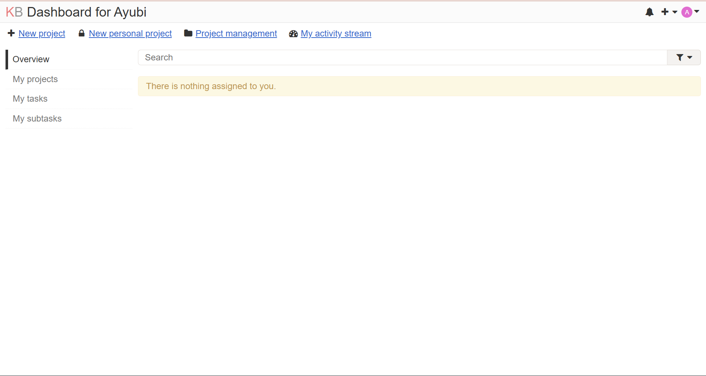

3. **Membuat proyek.** Klik **New project**, isi **Name** (misalnya *Tugas Komdat*). Kolom **Identifier** bersifat opsional dan hanya boleh berisi huruf dan angka tanpa spasi. Kolom **Task limit** menentukan batas jumlah *task* per kolom.

    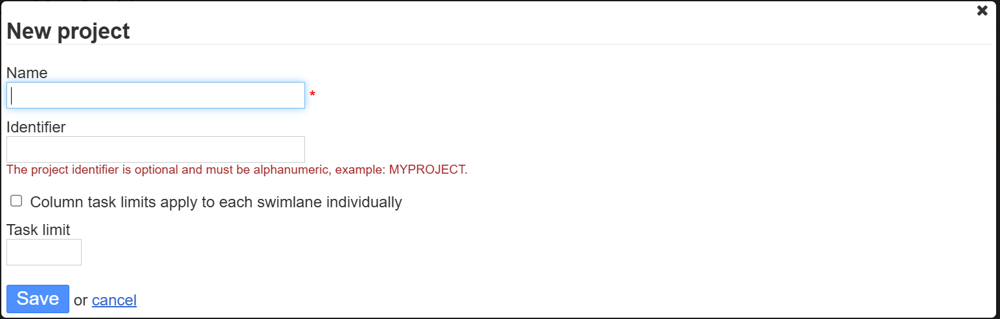

4. **Menambahkan anggota proyek.** Buka pengaturan proyek, pilih **Permissions**, lalu tambahkan pengguna dengan peran *Project Manager*, *Project Member*, atau *Project Viewer*. Hanya *Manager* dan *Member* yang dapat ditugaskan (*assign*) ke sebuah *task*.

    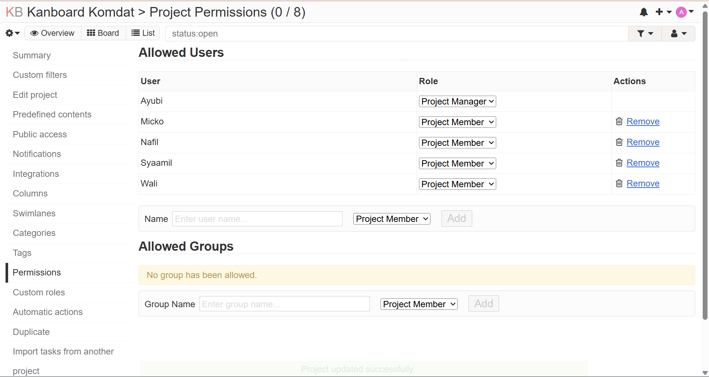

5. **Membuat *task* dan menugaskan anggota.** Klik ikon **+** pada kolom tujuan, isi judul, deskripsi (mendukung Markdown), **Assignee**, tenggat waktu, warna, kategori, dan *tag*.

    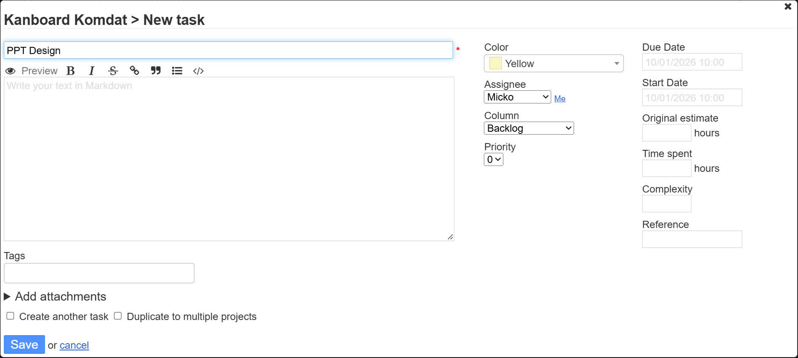

6. **Mengelola papan Kanban.** *Task* dipindahkan antar kolom dengan *drag-and-drop* untuk menandai perkembangan pekerjaan. Jika jumlah *task* melebihi *WIP limit*, Kanboard memberi tanda pada kolom tersebut.

    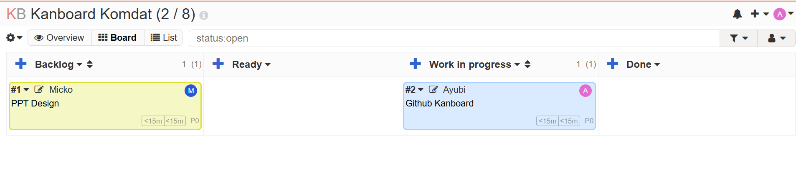

7. ***Subtask* dan komentar.** Buka detail *task* untuk menambahkan *subtask* (yang dapat ditugaskan ke orang lain), komentar diskusi, dan lampiran.

    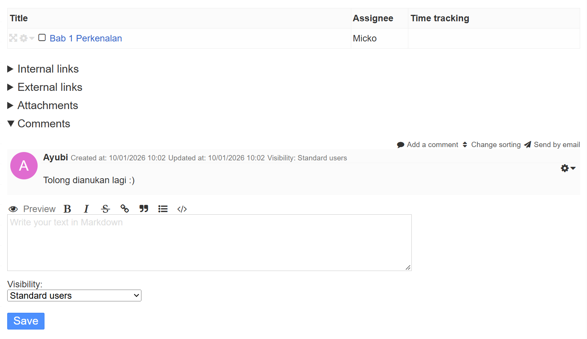

8. **Daftar tugas per pengguna.** Setiap anggota melihat *task* yang ditugaskan kepadanya di menu **My tasks** pada dashboard masing-masing.

    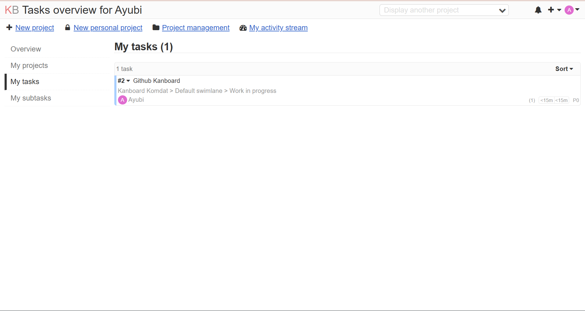

9. **Pencarian dan filter.** Kolom pencarian di atas papan mendukung sintaks lanjutan, misalnya `assignee:me` untuk *task* milik sendiri atau `status:open` untuk *task* yang masih terbuka.

    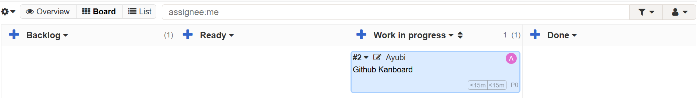

10. ***Automatic actions*.** Pada pengaturan proyek, aksi otomatis dapat dibuat, misalnya menutup *task* secara otomatis ketika dipindahkan ke kolom *Done*.

    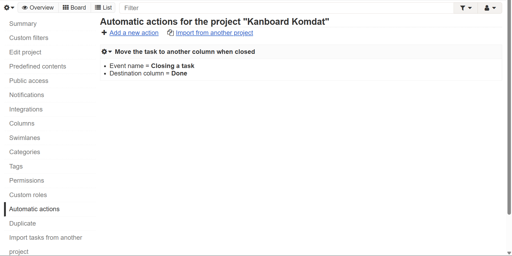

11. **Analitik proyek.** Menu analitik menampilkan grafik seperti distribusi *task* dan *cumulative flow diagram* untuk memantau kemajuan proyek.

    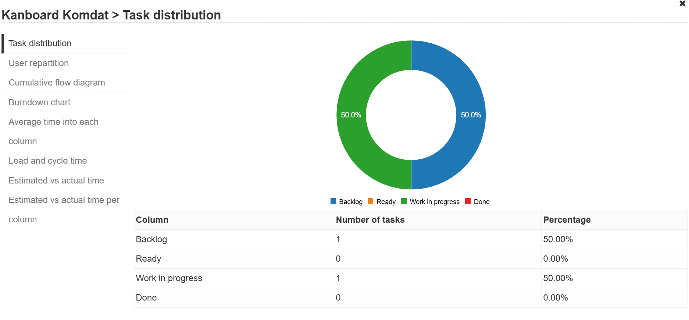

---

## Pembahasan

[`^ kembali ke atas ^`](#aplikasi-web-kanboard)

### Kelebihan

- **Open source dengan lisensi MIT**, bebas dipakai, dimodifikasi, dan di-*host* sendiri tanpa biaya lisensi atau batas jumlah pengguna.
- **Ringan dan mudah dipasang.** Dengan *image* Docker resmi, Kanboard dapat berjalan hanya dengan satu *container* dan SQLite. Pada VPS 2 GB RAM kami, aplikasi berjalan lancar.
- **Fitur Kanban yang lengkap**, seperti *WIP limit*, *swimlane*, *subtask*, *time tracking*, dan analitik, yang pada sebagian layanan komersial hanya tersedia di paket berbayar.
- ***Automatic actions*** mengurangi pekerjaan berulang.
- **Mudah diintegrasikan** melalui API JSON-RPC, *webhook*, dan *plugin*.
- **Data sepenuhnya milik sendiri** karena tersimpan di server kami.

### Kekurangan

- **Berstatus *maintenance mode***, sehingga fitur besar baru jarang ditambahkan.
- **Tampilan sederhana** dan terasa kurang modern dibandingkan Trello atau Planka.
- **Kurang praktis di layar kecil.** Dokumentasi resmi menyebut Kanboard dapat dibuka di ponsel, tetapi papan Kanban kurang nyaman dipakai di layar kecil.
- **Notifikasi email di Docker** memerlukan konfigurasi SMTP tambahan.
- **Konfigurasi bawaan (SQLite) kurang ideal untuk tim besar**; dokumentasi menyarankan PostgreSQL.
- **Harus dikelola sendiri**: pembaruan, *backup*, dan keamanan server menjadi tanggung jawab pengguna.

### Perbandingan dengan Aplikasi Sejenis

| Aspek | Kanboard | Trello | Wekan | Planka |
| --- | --- | --- | --- | --- |
| Model layanan | *Self-hosted* | Layanan *cloud* (Atlassian), tidak dapat di-*host* sendiri | *Self-hosted* | *Self-hosted* (juga tersedia versi *cloud*) |
| Lisensi | MIT (*open source*) | Proprietary, *freemium* | MIT (*open source*) | *Fair Use License* (*source-available*, bukan lisensi OSI) + paket Pro berbayar |
| Teknologi | PHP; SQLite/MySQL/MariaDB/PostgreSQL | - | Meteor (Node.js) + MongoDB | React + Node.js |
| Batas paket gratis | Tidak ada (bergantung kapasitas server) | 10 *board* dan 10 kolaborator per *workspace*, 250 *automation run* per bulan, 10 MB per berkas | Tidak ada | Edisi Community gratis untuk pemakaian internal; kolaborator eksternal, kalender, dan *recurring cards* hanya di Pro |
| Kebutuhan sumber daya | Ringan | Tidak perlu server | Minimal 1 GB RAM bebas | Tidak kami uji |
| Status pengembangan | *Maintenance mode* | Aktif (komersial) | Aktif, pembaruan sangat sering | Aktif (Community dan Pro) |
| Keunggulan khas | *WIP limit*, *swimlane*, *automatic actions*, *time tracking*, API | Antarmuka paling populer, *Power-Ups*, otomasi Butler, aplikasi *mobile* | Antarmuka *real-time* mirip Trello, lisensi bebas | Antarmuka modern mirip Trello, sinkronisasi *real-time* |

**Analisis singkat:**

- Dibanding **Trello**, Kanboard unggul dalam kendali data dan tidak dibatasi jumlah kolaborator atau *board*, tetapi kalah dalam kemudahan penggunaan, tampilan, dan dukungan aplikasi *mobile*. Trello lebih cocok bagi pengguna yang tidak ingin mengurus server.
- Dibanding **Wekan**, keduanya sama-sama berlisensi MIT. Wekan menawarkan antarmuka *real-time* yang lebih mirip Trello, tetapi memerlukan MongoDB dan sumber daya yang lebih besar, sedangkan Kanboard lebih ringan dan sederhana dipasang.
- Dibanding **Planka**, Planka memiliki tampilan paling modern, tetapi lisensinya bukan *open source* murni dan sebagian fitur kolaborasi hanya tersedia di paket berbayar. Kanboard lebih bebas secara lisensi.

### Kesimpulan

Kanboard cocok untuk tim kecil hingga menengah yang ingin menerapkan metode Kanban secara *self-hosted* dengan sumber daya server minimal dan tanpa biaya lisensi. Aplikasi ini stabil dan kaya fitur manajemen alur kerja, tetapi tampilannya sederhana dan pengembangannya sudah memasuki *maintenance mode*. Bagi tim yang mengutamakan antarmuka modern atau kemudahan tanpa mengelola server, Trello atau Planka bisa menjadi alternatif.

---

## Referensi

[`^ kembali ke atas ^`](#aplikasi-web-kanboard)

1. [Kanboard - Situs Resmi](https://kanboard.org/)
2. [Kanboard - Repositori GitHub](https://github.com/kanboard/kanboard)
3. [Kanboard Documentation - Docker Image Usage](https://docs.kanboard.org/v1/admin/docker/)
4. [Kanboard Documentation - Requirements and Prerequisites](https://docs.kanboard.org/v1/admin/requirements/)
5. [Docker Docs - Install Docker Engine on Ubuntu](https://docs.docker.com/engine/install/ubuntu/)
6. [awesome-selfhosted](https://github.com/awesome-selfhosted/awesome-selfhosted)
7. [Trello - Pricing](https://trello.com/pricing)
8. [WeKan - Repositori GitHub](https://github.com/wekan/wekan)
9. [PLANKA - Repositori GitHub](https://github.com/plankanban/planka)
10. [PLANKA - Community Edition](https://planka.app/community)
11. [Templat Laporan Komdat](https://github.com/auriza/komdat-lab/blob/master/templat.md)
